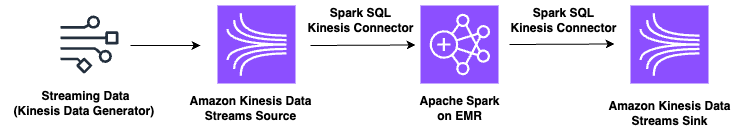

# Spark Structured Streaming Connector for Amazon Kinesis Data Streams using Amazon EMR

This sample shows how by using the Spark-Kinesis Connector we can use Apache Structured Streaming in Amazon EMR to consume data from Amazon Kinesis Data Streams.

The connector allows us to consume data using:
 - Standard consumers (getRecords)
 - Enhanced Fan Out Consumers (SubscribeToShards)

## Prerequisites

You will need to have 
- CDK CLI installed
- AWS Permissions to run CDK Commands and deploy the CloudFormation Template

## Architecture



The Cloudformation Template deploys the following:
- Kinesis Data Generator
- 2 Amazon Kinesis Data Streams (Source and Sink)
- Enhanced Fan Out Consumer for Source Kinesis Data Streams
- Amazon EMR 6.14 Cluster with
  - Spark 3.4.1
  - Hive 3.1.3
  - Hadoop 3.3.3
- EMR Step to download emr-spark-kinesis connector and store in EMR Cluster

## Getting Started

1. Git Clone this repository
``` 
git clone <repository>
```
2. Naviate into the directory
```
cd spark-kinesis-connector-emr-sample/cdk/emr-spark-kinesis
```
3. Download and install the necessary npm modules
```
npm install
```
4. Bootstrap the CDK Application
```
cdk bootstrap
```
5. Deploy the sample
```
cdk deploy
```

### Access Amazon EMR Primary Node

In order to facitilate acces to Primary Node. We have deployed the Amazon EMR Cluster with SSM, allowing us to use AWS SSM Session Manager.

1. Go to **[Amazon EMR](https://console.aws.amazon.com/emr/)**
2. Select the **emr-spark-kinesis** cluster
3. Go to instances(Hardware) and select the Primary Instance and click the **EC2 Instance ID**
4. Once you are in the EC2 Console, select the Primary Instance and click **Connect**
5. You will use AWS SSM to connect to the instance
6. As the user that is used to connect is the ssm-user, you will need to run the following code
```
sudo su
su hadoop
   ```

### Kinesis Data Generator

1. Go to the stack Outputs and click on the Generator URL
* User: Kinesis
* Password: Kinesis123
2. Select the AWS Region where you deployed
3. Choose the Kinesis Source Stream 
4. Use the following template to generate events
```
{
    "id": {{random.number(100)}},
    "data": "{{random.arrayElement(
        ["Spain","Portugal","Finland","France"]
    )}}",
    "date": "{{date.now("YYYY-MM-DD hh:mm:ss")}}"
}
```
5. Send records to Kinesis Stream

### Apache Spark Structured Streaming

In this sample, we will develop our code using the PySpark Shell on Amazon EMR. Execute the following snippets of code

1. Start the PySpark Shell
```
pyspark
```
#### Kinesis Spark Connector Source

2. Create Kinesis Source

> Change the endpointURL and region to point to where you deployed the sample

* If you want to create the source with a Standard Consumer (GetRecords)
```
   kinesis = spark.readStream.format("aws-kinesis") \
   .option("kinesis.region", "us-east-1") \
   .option("kinesis.streamName", "kinesis-source") \
   .option("kinesis.consumerType", "GetRecords") \
   .option("kinesis.endpointUrl", "https://kinesis.us-east-1.amazonaws.com") \
   .option("kinesis.startingposition", "LATEST") \
   .load()
   ```

* For creating a Kinesis Standard Source you need 
  * Name of the connector: aws-kinesis
  * Region : where Kinesis Data Stream is deployed
  * Consumer Type: GetRecords (Standard Consumer)
  * Kinesis Endpoint URL: Specific to each AWS Region
  * Kinesis Starting Position: Latest / Trim Horizon / At Timestamp

* If you want to use EFO for the consumer (SubscribeToShard)
* 
> Change the endpointURL and region to point to where you deployed the sample

```
kinesis_efo = spark \
.readStream \
.format("aws-kinesis") \
.option("kinesis.region", "us-east-1") \
.option("kinesis.streamName", "kinesis-source") \
.option("kinesis.consumerType", "SubscribeToShard") \
.option("kinesis.consumerName", "efo-consumer") \
.option("kinesis.endpointUrl", "https://kinesis.us-east-1.amazonaws.com") \
.option("kinesis.startingposition", "LATEST") \
.load()
```
* For creating the EFO Consumer you need to provide:
  * Consumer Type: SubscribeToShard
  * Consumer Name: EFO Consumer Name

#### Sample Processing

3. Let's provide a schema for the records, so we can do some processing.
```
from pyspark.sql.types import *
from pyspark.sql.functions import *

pythonSchema = StructType() \
 .add("id", LongType()) \
 .add("data", StringType()) \
 .add("date", TimestampType())

events= kinesis \
  .selectExpr("cast (data as STRING) jsonData") \
  .select(from_json("jsonData", pythonSchema).alias("events")) \
  .select("events.*")
```

4. Lets do a sample aggregation and print the data to console
```
events \
 .groupBy("data") \
 .count() \
 .writeStream \
 .format("console") \
 .outputMode("update") \
 .trigger(processingTime='120 seconds') \
 .start() \
 .awaitTermination()
```
> If you are generating a lot amount of data from the generator, results might take longer to be printed as the EMR Cluster deployed is quite small

#### Kinesis Spark Connector Sink

> Change the endpointURL and region to point to where you deployed the sample


5. Create Kinesis Sink
```
events \
.selectExpr("CAST(id AS STRING) as partitionKey","data","date") \
.writeStream \
.format("aws-kinesis") \
.option("kinesis.region", "us-east-1") \
.outputMode("append") \
.option("kinesis.streamName", "kinesis-sink") \
.option("kinesis.endpointUrl", "https://kinesis.us-east-1.amazonaws.com") \
.option("checkpointLocation", "/kinesisCheckpoint") \
.start() \
.awaitTermination()
```

If you want you can go to Amazon Kinesis Data Streams and select the kinesis-sink, and see the data using the Data Viewer feature

## Clean Up
You can now go and delete the CloudFormation Template

## Security

See [CONTRIBUTING](CONTRIBUTING.md#security-issue-notifications) for more information.

## License

This library is licensed under the MIT-0 License. See the LICENSE file.

